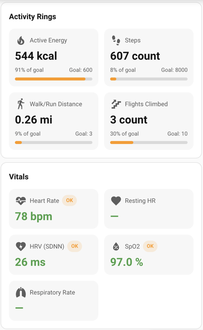

# Healthsync Fitness Cards

Lovelace cards for Apple Health style fitness data. Metrics stay user-configured (no hardcoded entities) and formatting is inferred from units. Includes presets, trends, period windows, localization hooks, and UI editors.

## What’s inside
- Cards: `fitness-activity-summary-card`, `fitness-vitals-card`, `fitness-sleep-card`, `fitness-body-metrics-card`, `fitness-workouts-card`, `fitness-overview-card`
- Shared formatting for energy, distance, steps, vitals, body metrics, sleep stages, workouts
- Theme-aware styling for Home Assistant dark/light modes
- Metric catalog derived from `ha-apple-health-states.filtered.json` in `data/metric-catalog.json`
- Localization scaffolding (`languages/en.json`, `languages/es.json`)
- HA UI editors for every card

## Installation
1. Copy `dist/fitness-cards.js` to `config/www/community/healthsync-ha-cards/`.
2. Add a Lovelace resource: URL `/local/community/healthsync-ha-cards/fitness-cards.js`, type `module`. (HACS installs can use `/hacsfiles/healthsync-ha-cards/fitness-cards.js`.)
3. Refresh the UI or clear cache.

## Shared config model
- `metrics`: array of entries supporting `entity`, `name`, `icon`, `unit_override`, `decimals`, `goal` (number) or `goal_entity`, `ranges`, `preset`, `trend_entity`
- `period`: `current | today | 7d | 30d` (default `current`)
- `show_trends`: toggle trend delta display (defaults to on)
- `compact`: tighten padding
- Sleep-only: `stage` (`asleep|in_bed|core|deep|rem|unknown`)
- Card-level `preset`: auto-fill sensible metrics for that card (you still map entities)

Formatting defaults by unit:
- `bpm`, `breaths/min`, `count`, `kcal`, `ms`, `mg/dL`, `s` → 0 decimals
- `%` → 1 decimal
- `lb`, `fl oz US` → 1 decimal
- `mi` → 2 decimals
- Minutes auto-format to `xh ym` when large; unknown/unavailable renders as `—`

## Mapping your own entities
Pick your sensors in HA Developer Tools → States, copy the entity IDs, and map them into the `metrics` array (or via the UI editor). If your units differ, set `unit_override`/`decimals`. Goals can be a number or `goal_entity`. Sleep stages auto-detect from the entity id or can be forced with `stage`.

## Auto-detect (editor action)
In the visual editor, click **Auto-detect metrics** to scan your HA entities. Suggestions are shown with checkboxes—accept what you like, then apply. The editor writes normal presets + entity mappings into your config (no runtime dependency).

Example result applied to a card:
```yaml
- type: custom:fitness-vitals-card
  metrics:
    - preset: heart_rate
      entity: sensor.health_heart_rate
    - preset: spo2
      entity: sensor.health_oxygen_saturation
```

## History & visuals (optional)
- Config: `history` (bool), `history_window_days` (default 7), `history_points` (default 24)
- Shows sparklines on overview/vitals/body (when history is on)
- Activity card shows weekly bars when period is `7d` or `30d`
- Trend labels show comparison vs the previous window (e.g., “vs previous 7 days”)

## Goals & zones
- Card-level `goals` map: `{ heart_rate: 90, steps: 8000 }` (per-metric overrides still work)
- Card-level `zones` map: `{ heart_rate: { bands: [{label: "High", min: 110, severity:"high"}] } }`
- Defaults included for heart_rate, resting_heart_rate, spo2, respiratory_rate, glucose, weight trend
- Disable per metric with `zones_disabled: true`

## Dashboard generator (optional)
- `node tools/generate-view.js` prints a Lovelace view using preset mappings—edit the preset/entity lists in the script first.
- Paste the JSON into your Lovelace raw config or convert to YAML as needed.

## Screenshots



## Examples (using anonymized sample entities)
The examples below use the provided catalog, replacing the prefix with `sensor.health_*`.

### Activity summary
**Manual config**
```yaml
- type: custom:fitness-activity-summary-card
  title: Activity Rings
  period: today
  history: true
  history_window_days: 7
  metrics:
    - entity: sensor.health_active_energy_burned_daily_total
      name: Active Energy
      icon: mdi:fire
      goal: 600
    - entity: sensor.health_steps_daily_total
      name: Steps
      icon: mdi:shoe-print
      goal: 8000
    - entity: sensor.health_distance_walking_running_daily_total
      name: Walk/Run Distance
      icon: mdi:walk
      goal: 3
      decimals: 2
    - entity: sensor.health_flights_climbed_daily_total
      name: Flights Climbed
      icon: mdi:stairs-up
      goal: 10
```

**Preset-based**
```yaml
- type: custom:fitness-activity-summary-card
  preset: activity
  history: true
  period: 7d
  metrics:
    - preset: active_energy
      entity: sensor.health_active_energy_burned_daily_total
      goal: 600
    - preset: steps
      entity: sensor.health_steps_daily_total
      goal: 8000
    - preset: distance_walk_run
      entity: sensor.health_distance_walking_running_daily_total
      goal: 3
    - preset: flights_climbed
      entity: sensor.health_flights_climbed_daily_total
      goal: 10
```

### Vitals
**Manual config**
```yaml
- type: custom:fitness-vitals-card
  title: Vitals
  history: true
  metrics:
    - entity: sensor.health_heart_rate
      name: Heart Rate
      icon: mdi:heart-pulse
      ranges: { low: 50, normal: [55, 95], high: 120 }
    - entity: sensor.health_resting_heart_rate
      name: Resting HR
      icon: mdi:heart
      ranges: { low: 45, normal: [50, 90], high: 110 }
    - entity: sensor.health_heart_rate_variability_sdnn
      name: HRV (SDNN)
      icon: mdi:heart-flash
      ranges: { low: 20 }
    - entity: sensor.health_oxygen_saturation
      name: SpO2
      icon: mdi:water-percent
      ranges: { low: 92, normal: [95, 100] }
    - entity: sensor.health_respiratory_rate
      name: Respiratory Rate
      icon: mdi:lungs
      ranges: { low: 10, normal: [12, 20], high: 24 }
```

**Preset-based**
```yaml
- type: custom:fitness-vitals-card
  preset: vitals
  metrics:
    - preset: heart_rate
      entity: sensor.health_heart_rate
    - preset: resting_heart_rate
      entity: sensor.health_resting_heart_rate
    - preset: hrv_sdnn
      entity: sensor.health_heart_rate_variability_sdnn
    - preset: spo2
      entity: sensor.health_oxygen_saturation
    - preset: respiratory_rate
      entity: sensor.health_respiratory_rate
```

### Sleep
**Manual config**
```yaml
- type: custom:fitness-sleep-card
  title: Sleep
  metrics:
    - entity: sensor.health_sleep_asleep
      name: Asleep
      stage: asleep
    - entity: sensor.health_sleep_in_bed
      name: In Bed
      stage: in_bed
    - entity: sensor.health_sleep_core
      name: Core
      stage: core
    - entity: sensor.health_sleep_deep
      name: Deep
      stage: deep
    - entity: sensor.health_sleep_rem
      name: REM
      stage: rem
    - entity: sensor.health_sleep_unknown
      name: Unknown
      stage: unknown
```

**Preset-based**
```yaml
- type: custom:fitness-sleep-card
  preset: sleep
  metrics:
    - preset: asleep
      entity: sensor.health_sleep_asleep
    - preset: in_bed
      entity: sensor.health_sleep_in_bed
    - preset: sleep_core
      entity: sensor.health_sleep_core
    - preset: sleep_deep
      entity: sensor.health_sleep_deep
    - preset: sleep_rem
      entity: sensor.health_sleep_rem
    - preset: sleep_unknown
      entity: sensor.health_sleep_unknown
```

### Body metrics
**Manual config**
```yaml
- type: custom:fitness-body-metrics-card
  title: Body Metrics
  history: true
  metrics:
    - entity: sensor.health_weight
      name: Weight
      icon: mdi:scale-bathroom
      decimals: 1
    - entity: sensor.health_bmi
      name: BMI
      icon: mdi:human-male-height
      decimals: 1
    - entity: sensor.health_body_fat_percentage
      name: Body Fat
      icon: mdi:percent
      unit_override: "%"
    - entity: sensor.health_lean_body_mass
      name: Lean Mass
      icon: mdi:human
      decimals: 1
    - entity: sensor.health_vo2_max
      name: VO2 Max
      icon: mdi:run
      decimals: 1
```

**Preset-based**
```yaml
- type: custom:fitness-body-metrics-card
  preset: body
  metrics:
    - preset: weight
      entity: sensor.health_weight
    - preset: bmi
      entity: sensor.health_bmi
    - preset: body_fat_percentage
      entity: sensor.health_body_fat_percentage
    - preset: lean_body_mass
      entity: sensor.health_lean_body_mass
    - preset: vo2_max
      entity: sensor.health_vo2_max
```

### Workouts
```yaml
- type: custom:fitness-workouts-card
  title: Workouts
  period: today
  workouts:
    - name: Walking
      icon: mdi:walk
      duration_entity: sensor.health_workout_duration_walking
      energy_entity: sensor.health_workout_energy_walking
      distance_entity: sensor.health_workout_distance_walking
    - name: Cycling
      icon: mdi:bike
      duration_entity: sensor.health_workout_duration_cycling
      energy_entity: sensor.health_workout_energy_cycling
      distance_entity: sensor.health_workout_distance_cycling
    - name: Strength Training
      icon: mdi:weight-lifter
      duration_entity: sensor.health_workout_duration_strength_training
      energy_entity: sensor.health_workout_energy_strength_training
```

### Overview
```yaml
- type: custom:fitness-overview-card
  title: Overview
  period: 7d
  history: true
  primary_metrics:
    - preset: active_energy
      entity: sensor.health_active_energy_burned_daily_total
      goal: 600
    - preset: steps
      entity: sensor.health_steps_daily_total
      goal: 8000
    - preset: distance_walk_run
      entity: sensor.health_distance_walking_running_daily_total
    - preset: weight
      entity: sensor.health_weight
  secondary_metrics:
    - preset: heart_rate
      entity: sensor.health_heart_rate
    - preset: spo2
      entity: sensor.health_oxygen_saturation
    - preset: body_fat_percentage
      entity: sensor.health_body_fat_percentage
```

## Presets
- Card-level `preset` seeds sensible metric entries for activity, vitals, sleep, body, workouts, overview.
- Metric-level `preset` (e.g., `preset: heart_rate`) fills name/icon/unit/decimals/ranges; you still set `entity`.

## Trends and periods
- `period` controls the comparison window (`current`, `today`, `7d`, `30d`).
- Trends compare against the previous period (using HA history API) or previous reading (for `current`). Optionally supply `trend_entity` per metric.

## Localization
- Strings resolve via `localize()` with English fallback. Translations live in `languages/en.json` and `languages/es.json`. Add your language by extending that folder.

## UI editor
- Every card ships with a visual editor. In Lovelace, choose “Show visual editor”, pick presets, map entities, set period/trends/goals, and save. Metrics arrays can be added/removed/reordered directly in the editor.
